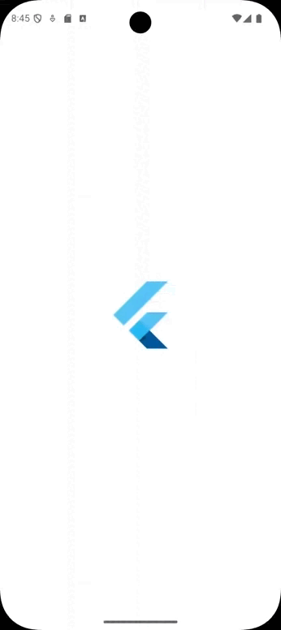

# 💈 Projeto de Portfólio: Aplicação Barbearia Rei Du Corte

  

## 📌 Visão Geral do Projeto

Este projeto nasceu da necessidade de evoluir a presença digital de um cliente real, a barbearia "Rei Du Corte", cujo website de agendamento também desenvolvido por mim já opera com sucesso há mais de um ano (https://www.barbeariareiducorte.com.br). Fui responsável pelo desenvolvimento completo da nova aplicação móvel (Flutter/Dart e Firebase) como freelancer, gerindo todo o ciclo de vida do projeto: desde as reuniões iniciais com o cliente e o design da interface, até à programação, implementação do backend e suporte contínuo, oferecendo uma experiência de utilizador mais rica e funcionalidades de agendamento direto.

Este repositório demonstra competências em:

- **Desenvolvimento de aplicações móveis** com *Flutter*
- **Integração com serviços de backend** (*Firebase*)

> **Aviso Importante:**  
> A marca **"Rei Du Corte"**, o seu logótipo e outros ativos visuais são propriedade do cliente.  
> Este projeto é exposto apenas para fins de portfólio.  
> O código **não** se destina a ser replicado ou distribuído, e as **chaves de API foram removidas**.

---

## ✨ Funcionalidades Desenvolvidas

- **Sistema de Autenticação Completo**  
  Implementação de cadastro e login seguros com **Firebase Authentication**.

- **Catálogo de Serviços Dinâmico**  
  Visualização de serviços com imagens e preços em tempo real via **Cloud Firestore**.

- **Agendamento Interativo**  
  Sistema robusto com calendário e horários disponíveis para marcação.

- **Gestão de Agendamentos Pessoais**  
  Área dedicada para visualizar e cancelar agendamentos com atualização instantânea.

- **Perfil de Utilizador Editável**  
  Possibilidade de editar informações pessoais diretamente na aplicação.

---

## 🛠️ Tecnologias e Arquitetura

| **Categoria**       | **Tecnologia / Metodologia**                          |
|---------------------|-------------------------------------------------------|
| **Framework**       | Flutter                                               |
| **Linguagem**       | Dart                                                  |
| **Base de Dados**   | Cloud Firestore *(NoSQL em tempo real)*               |
| **Autenticação**    | Firebase Authentication                               |
| **Gestão de Chaves**| `.env` para proteção de dados sensíveis               |
| **Arquitetura**     | Separação de responsabilidades (UI, serviços, modelos)|

---

## 🚀 Destaques Técnicos

- **Sincronização em Tempo Real**  
  Uso de *Streams* do Firestore para atualização automática da interface.

- **Segurança Avançada**  
  Regras no Firestore para restringir acesso e edição apenas aos dados do próprio utilizador.

- **Componentização**  
  Criação de widgets reutilizáveis, como **AppDrawer**, para código limpo e organizado.

---

## 📜 Licença

O código-fonte deste projeto está sob a **licença MIT**.

> **Nota:** Esta licença **não se aplica** à marca, logótipo ou ativos visuais da **"Rei Du Corte"**.  
> Consulte o ficheiro `LICENSE` para mais detalhes.
